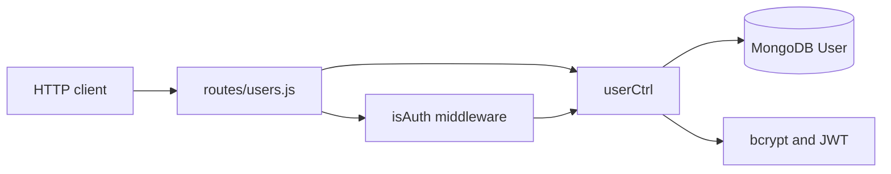
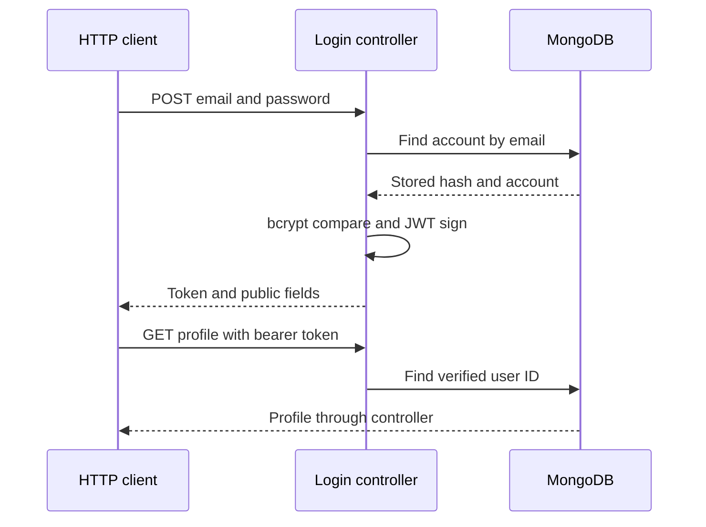

# Architecture: Authentication API

[README](README.md) · [Architecture](ARCHITECTURE.md) · [Technical deep dive](TECHNICAL_DEEP_DIVE.md) · [Development progress](DEVELOPMENT_PROGRESS.md)

**Source:** [Authentication-API](<../../Authentication-API>)

## System Overview

`app.js` composes JSON parsing, a single user router, and a final error handler. Controllers own both business logic and database access. JWT verification is separate middleware.

## Architecture Diagram

## Component Breakdown

### HTTP composition

**Files:** `app.js`, `routes/users.js`

Starts MongoDB connection and the server independently, mounts the router at `/`, and places error middleware after routes.

### Account controller

**Files:** `controller/user.js`

`register`, `login`, and `profile` query `User`, hash or compare passwords, create tokens, and shape responses.

### Authorization and persistence

**Files:** `middlewares/isAuth.js`, `model/User.js`

Middleware extracts a token and supplies `req.user`; the schema requires username, email, and password with timestamps.

## Data Flow

A registration request is checked for required fields and an existing email, hashed with bcrypt, and inserted into MongoDB. Login finds the account and compares its password before returning a JWT. Profile requests pass a bearer token to middleware, which verifies it and passes the decoded ID to the controller.

## Important Classes / Modules

`userCtrl` groups the three account actions. `isAuthenticated` extracts the second space-separated authorization segment, verifies the JWT, and forwards the decoded ID. `errorHandler` serializes error messages and stacks.

## Database / Data Model

`User` contains required string fields `username`, `email`, and hashed `password`, plus timestamps. Email uniqueness is checked in application logic but has no unique schema index; concurrent registration can bypass the check.

## APIs

| Method | Endpoint | Request | Success response |
|---|---|---|---|
| POST | `/api/users/register` | `username`, `email`, `password` | `username`, `email`, `id` |
| POST | `/api/users/login` | `email`, `password` | `message`, `token`, `id`, `email`, `username` |
| GET | `/api/users/profile` | Bearer token | `{ user }` without password |

## Security Architecture

bcrypt uses a generated salt with cost 10. Tokens expire after 30 days. The signing value is a hard-coded literal shared by issuance and verification, and database connection information is embedded in source. Registration logs the entire request body; controllers also log user records. The error response includes stack traces. There is no rate limiting, revocation, role authorization, or token refresh flow.

## Dependencies

Mongoose maps accounts to MongoDB; bcryptjs handles password hashes; jsonwebtoken handles tokens; express-async-handler forwards controller rejections to Express. The authentication middleware itself is not wrapped by that helper.

## Configuration and Deployment

No Docker or CI configuration was found. Startup logs database failures but does not wait for a successful database connection before listening. There is no environment configuration contract.

Assessment: source review of this workspace snapshot, 24 September 2026. Implemented means present in code; external services, cloud deployments, model accuracy, and end-to-end operation were not verified. No source changes were made.

